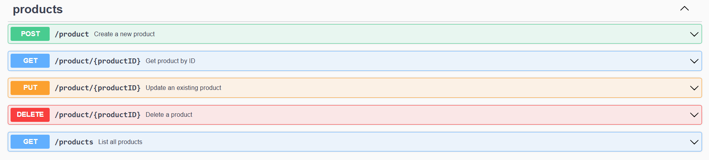

# API Golab Tutoriais

Uma API RESTful em Go simples, que fornece endpoints básicos para criar, atualizar, deletar e listar produtos, utilizando um banco de dados PostgreSQL executado dentro de uma imagem Docker (assim como o back-end). Um arquivo docker-compose.yml foi incluído para facilitar a construção e execução de ambos os contêineres.

Esta API é baseada no vídeo **"Como criar uma REST API completa do zero com GO | Golang tutorial - iniciante"** do canal _Go Lab Tutoriais_, com algumas alterações, adições e adaptações próprias.

**Link do vídeo:** https://youtu.be/3p4mpId_ZU8

## Conteúdo:

1. [Pré-requisitos](#pré-requisitos)
    1. [Go](#1-go)
    2. [Git](#2-git)
    3. [Editor de Código](#3-editor-de-código)
    4. [Swag](#4-swag)
    5. [PostgreSQL ou Docker](#5-postgresql-ou-docker)
    6. [pgAdmin ou DBeaver](#6-pgadmin-4-ou-dbeaver)
    7. [Postman](#7-postman)
2. [Dica (Docker Compose)](#💡-dica)
3. [Versões Estáveis](#versões-estáveis)
4. [Extensões Recomendadas do VS Code](#extensões-recomendadas-do-vs-code)
5. [Executando a Aplicação](#executando-a-aplicação)
6. [Endpoints](#endpoints)
    1. [Inserir um Novo Produto](#1-inserir-um-novo-produto)
    2. [Deletar um Produto por Id](#2-deletar-um-produto-por-id)
    3. [Obter todos os Produtos](#3-obter-todos-os-produtos)
    4. [Obter um Produto por Id](#4-obter-um-produto-por-id)
    5. [Atualizar um Produto por Id](#5-atualizar-um-produto-por-id)
7. [Documentação Oficial](#documentação-oficial)

<br>

## Pré-requisitos

Para utilizar as funcionalidades deste programa, é necessário possuir as ferramentas listadas abaixo.
Cada uma desempenha um papel essencial no desenvolvimento, execução e manutenção da aplicação.

---

### 1. [Go](https://golang.google.cn/dl/)

Linguagem de programação criada pela Google e base fundamental deste projeto.
A API foi desenvolvida com a versão 1.25.1, mas qualquer versão a partir da 1.18 é suficiente para compilar e executar corretamente o código, garantindo compatibilidade com todas as dependências.

---

### 2. [Git](https://git-scm.com/downloads)

Sistema de controle de versões distribuído utilizado para clonar o repositório e acompanhar o histórico de desenvolvimento do projeto.

---

### 3. [Editor de código](https://code.visualstudio.com/download)

Ferramenta usada para escrever e editar o código-fonte do programa.
Embora qualquer editor de texto funcione, recomenda-se utilizar um editor moderno com recursos como:

- auto-completar código,

- destaque de sintaxe,

- integração com depuradores e extensões.

<br>

O Visual Studio Code é a melhor escolha para quem busca portabilidade, praticidade e ampla personalização.
Para quem deseja recursos avançados de análise e depuração específicos para Go, o **GoLand** é uma alternativa mais profissional.

---

### 4. [Swag](https://github.com/swaggo/swag)

Ferramenta que gera automaticamente a documentação **Swagger/OpenAPI** a partir dos comentários do código Go.
Ela interpreta as anotações nas funções (controllers) e cria arquivos que permitem visualizar e interagir com os endpoints da API via navegador.

- **Instalação:**

  ```bash
  go install github.com/swaggo/swag/cmd/swag@latest
  ```

- **Comando principal:**

  ```bash
  swag init -g cmd/main.go
  ```

---

### 5. [PostgreSQL](https://www.postgresql.org/download/) ou [Docker](https://www.docker.com/get-started/)

Sistema de gerenciamento de banco de dados relacional (SGBD) que permite armazenar, manipular e consultar dados por meio da linguagem SQL.
É amplamente utilizado devido à sua eficiência, confiabilidade e suporte a grandes volumes de dados.
Além disso, é gratuito e de código aberto (licença PostgreSQL License).

<br>

💡 Como alternativa, é possível utilizar um contêiner Docker com a imagem oficial do PostgreSQL configurada para conexão com a aplicação. Nesse caso, é interessante utilizar o site [Docker Hub](https://hub.docker.com/). Abaixo está o link para a imagem do Postgres:

- **PostgreSQL (Docker Hub):** https://hub.docker.com/_/postgres

---

### 6. [pgAdmin 4](https://www.pgadmin.org/download/) ou [DBeaver](https://dbeaver.io/download/)

Ferramenta gráfica oficial para gerenciamento de bancos de dados PostgreSQL.
Permite escrever e executar consultas SQL, monitorar desempenho, gerenciar usuários e permissões, criar backups, configurar replicação e muito mais.

Como alternativa, pode-se utilizar o DBeaver, que oferece suporte não apenas ao PostgreSQL, mas também a diversos outros SGBDs (relacionais e NoSQL).

<br>

- **Alternativa:** é uma extensão que permite gerenciar bancos de dados diretamente no VS Code.
Suporta bancos SQL e NoSQL, embora sua versão gratuita limite o número de conexões simultâneas.

    - **Database Client:** https://marketplace.visualstudio.com/items?itemName=cweijan.vscode-database-client2

---

### 7. [Postman](https://www.postman.com/downloads/)

Ferramenta gráfica para testes e validação de endpoints de APIs.
Permite enviar requisições HTTP (GET, POST, PUT, DELETE etc.), inspecionar respostas, testar autenticação e automatizar coleções de testes.
Pode ser utilizada como aplicativo independente ou integrada ao VS Code por meio da extensão oficial.

<br>

- **Postman:** https://marketplace.visualstudio.com/items?itemName=Postman.postman-for-vscode

---

<br>

## 💡 Dica

Para um ambiente de desenvolvimento limpo e reproduzível, recomenda-se utilizar Docker Compose para orquestrar o container da aplicação Go e o container PostgreSQL, mantendo as variáveis de ambiente centralizadas em um arquivo **.env**.

<br>

## Versões Estáveis

- **Go:** 1.18+
- **Git:** 2.13+
- **VS Code:** 1.80+
- **PostgreSQL:** 12+
- **Docker:** 20.10+
- **pgAdmin 4:** 6.21+
- **DBeaver:** 8.0+
- **Postman:** 9.0+

<br>

## Extensões recomendadas do VS Code:

Por ser um editor de código leve e modular, o VS Code depende de extensões para oferecer suporte completo ao desenvolvimento em Go, incluindo compilação, depuração e recursos de produtividade.

---

### [Go (by Go Team at Google)](https://marketplace.visualstudio.com/items?itemName=VisualStudioExptTeam.vscodeintellicodehttps://code.visualstudio.com/docs/languages/go)

Extensão oficial mantida pelo time do Go.
Ela adiciona suporte nativo à linguagem, permitindo:

- **Compilação e execução** de programas Go diretamente no editor
- **IntelliSense** com autocompletar inteligente e sugestões contextuais
- **Destaque semântico de sintaxe (Semantic Syntax Highlighting)**
- **Refatoração e formatação automática de código**
- **Navegação entre definições e referências**
- **Análise estática de código e diagnósticos em tempo real**

<br>

Essa extensão é essencial para qualquer desenvolvedor que utilize o VS Code como ambiente principal de desenvolvimento Go.

---

<br>

## Executando a aplicação:

“Antes de iniciar, é necessário clonar o repositório do projeto para o seu ambiente local.”

```bash
git clone https://github.com/onlytesting-user/api-golab
```

<br>

Em seguida, acesse o diretório do projeto e, na raiz, execute o comando abaixo para construir todos os contêineres necessários e iniciar a aplicação:

```bash
docker compose up -d
```

<br>

Após a execução bem-sucedida, a API estará disponível localmente.
Você poderá acessá-la através de ferramentas como o Postman ou diretamente pelo navegador (para endpoints GET).

```txt
# GetProducts

http://localhost:8000/products


# GetProductByID
# substitua {productID} por um valor numérico válido (ex: 1, 2, 3...)

http://localhost:8000/product/{productID}
```
<br>

Para visualizar a documentação interativa da API (Swagger UI), acesse no navegador:

```txt
http://localhost:8000/swagger/index.html
```

<br>

A interface do Swagger permite explorar os endpoints disponíveis, enviar requisições de teste e visualizar exemplos de resposta diretamente pelo navegador.

<br>

## Endpoints



---

### 1. Inserir um novo produto

#### POST `/product`
Insere um novo produto na base de dados, sendo o ID um dado auto-incremental cuja passagem no Request Body não é necessária.

### Corpo da requisição:

```json
{
  "price": 150,
  "product_name": "Headphones"
}
```

### Exemplo de corpo da resposta:

```json
{
  "id_product": 18,
  "product_name": "Headphones",
  "price": 150
}
```

<br>

O campo id_product corresponde ao identificador único do produto no banco.

### Respostas:

Código | Descrição
---|---
201	| Created
400 | Bad Request
500 | Internal Server Error

---

### 2. Deletar um produto por ID

#### DELETE `/product/{productID}`
Deleta um produto existente no banco de dados com base em seu ID.

### Parâmetro:

- **`id` (integer):** O identificador do produto.

### Exemplo de corpo da resposta:

**Ex:** /product/18

```json
{
  "Message": "Product deleted successfully"
}
```

### Respostas:

Código | Descrição
---|---
200	| OK
400 | Bad Request
500 | Internal Server Error

---

### 3. Obter todos os produtos

#### GET `/products`
Retorna uma lista de todos os produtos já cadastrados na base de dados.

### Exemplo de corpo da resposta:

```json
[
  {
    "id_product": 1,
    "product_name": "Keyboard",
    "price": 50
  },
  {
    "id_product": 2,
    "product_name": "Monitor",
    "price": 300
  },
  {
    "id_product": 3,
    "product_name": "Cabinet",
    "price": 150
  }
]
```

### Respostas:

Código | Descrição
---|---
200	| OK
500 | Internal Server Error

---

### 4. Obter um produto por ID

#### GET `/product/{productID}`
Obtém os detalhes de um produto em específico cadastrado no banco de dados com base em seu ID.

### Parâmetro:

- **`id` (integer):** O identificador do produto.

### Exemplo de corpo da resposta:

**Ex:** /product/5

```json
{
  "id_product": 5,
  "product_name": "Smartphone",
  "price": 1100
}
```

### Respostas:

Código | Descrição
---|---
200	| OK
400 | Bad Request
404 | Not Found
500 | Internal Server Error

---

### 5. Atualizar um produto por ID

#### PUT `/product/{productID}`
Atualiza os dados de um produto existente no banco de dados com base em seu ID.

### Parâmetro:

- **`id` (integer):** O identificador do produto.

#### Corpo da requisição:

```json
{
  "price": 15,
  "product_name": "Mouse"
}
```

### Exemplo de corpo da resposta:

**Ex:** /product/8

```json
{
  "id_product": 8,
  "product_name": "Mouse",
  "price": 15
}
```

### Respostas:

Código | Descrição
---|---
200	| OK
400 | Bad Request
500 | Internal Server Error

---

<br>

## Documentação Oficial:

- **Go:** https://go.dev/doc/
- **Git:** https://git-scm.com/docs/git
- **Swagger:** https://swagger.io/docs/
- **PostgreSQL:** https://www.postgresql.org/docs/
- **pgAdmin 4:** https://www.pgadmin.org/docs/
- **Docker:** https://docs.docker.com/
- **DBeaver:** https://dbeaver.com/docs/dbeaver/
- **Postman:** https://learning.postman.com/docs/getting-started/overview/

<br>


